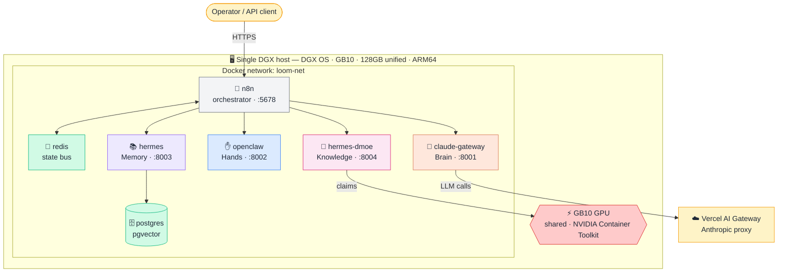
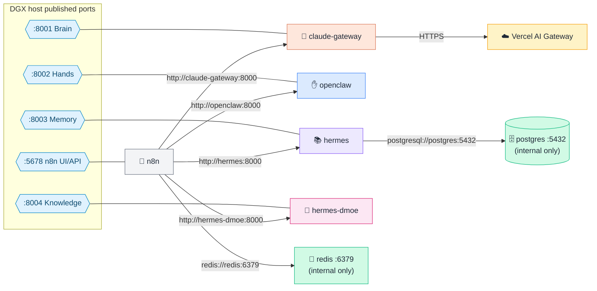
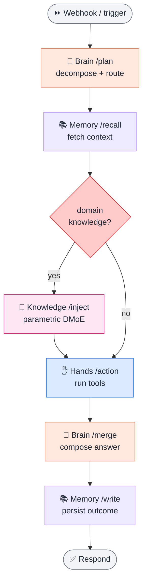
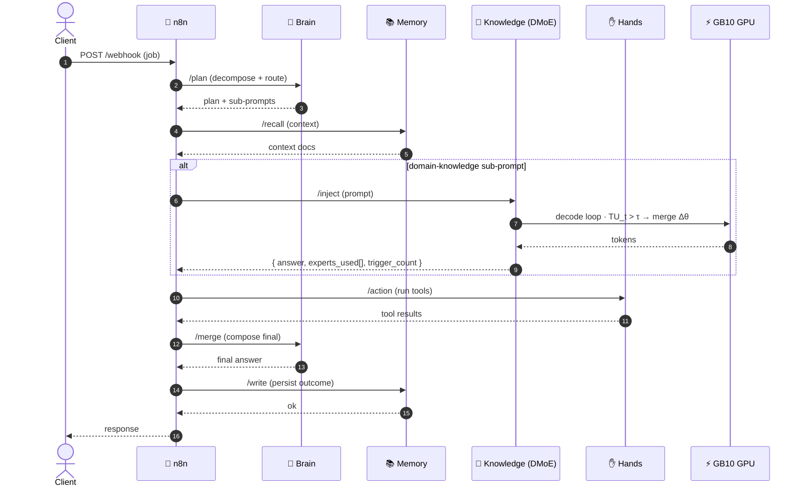
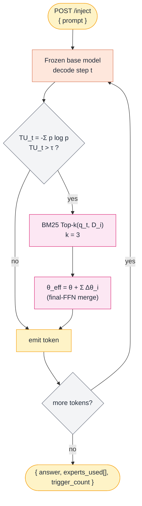

# GateForge-Loom-DMoE

**Single-box deployment of the GateForge-Loom agent stack with true parametric
Decoupled Mixture-of-Experts (DMoE) — everything in Docker on one NVIDIA DGX
(GB10 / Grace-Blackwell) host.**

> One machine. One Docker network. One shared GB10 GPU. The full Brain / Hands /
> Memory / Knowledge loom, plus weight-level knowledge injection
> ([DMoE, arXiv:2606.14243](https://arxiv.org/abs/2606.14243)), brought up with a
> single `docker compose up`.

---

## Table of contents

1. [Why single-box DGX?](#why-single-box-dgx)
2. [Hardware baseline (GB10)](#hardware-baseline-gb10)
3. [Components](#components)
4. [1. Architecture diagram](#1-architecture-diagram)
5. [2. Connection diagram (ports & links)](#2-connection-diagram-ports--links)
6. [3. Workflow diagram (the n8n pipeline)](#3-workflow-diagram-the-n8n-pipeline)
7. [4. Animated SVG pipeline](#4-animated-svg-pipeline)
8. [5. Sequence diagram (one job, end-to-end)](#5-sequence-diagram-one-job-end-to-end)
9. [6. DMoE internals (how `/inject` works)](#6-dmoe-internals-how-inject-works)
10. [Installation guide](#installation-guide)
11. [OS update guide](#os-update-guide)
12. [Backup and restore guide](#backup-and-restore-guide)
13. [Troubleshooting](#troubleshooting)

---

## Why single-box DGX?

The original GateForge-Loom ran across a **3-VM hybrid** (Brain+Orchestrator,
Hands, Memory+Knowledge) meshed over Tailscale. A **GB10** box collapses all of
that onto **one machine**:

- **One real CUDA GPU** runs the paper's *true* parametric DMoE — the frozen base
  model merges LoRA experts into its weights at decode time. No approximation.
- **128 GB unified memory** is plenty for the whole stack (Brain gateway,
  Postgres/pgvector, Redis, n8n, OpenClaw) **plus** the DMoE base model and a
  large expert bank — with head-room to run a bigger base model later.
- **Containers, not VMs.** The GB10 has a single GPU that cannot be cleanly split
  across multiple VMs, and its GPU is "container-first" (GPU access is reliable
  inside NVIDIA NGC containers). So every service is a **Docker container** on one
  `loom-net` network, sharing the GPU through the NVIDIA Container Toolkit.

> **Trade-off — single point of failure.** Everything on one box means one box
> down = whole stack down. That is fine for R&D / PoC. For production, replicate
> to a second GB10 (its dual ConnectX-7 200 GbE is built for clustering) and
> restore from the [backup guide](#backup-and-restore-guide).

---

## Hardware baseline (GB10)

| Spec | Value |
|---|---|
| SoC | NVIDIA Grace-Blackwell **GB10** |
| CPU | 20-core Arm (10× Cortex-X925 + 10× Cortex-A725) |
| GPU | Blackwell, 5th-gen Tensor Cores, **CUDA SM121** |
| Memory | **128 GB LPDDR5x unified** (CPU+GPU coherent), 256-bit, 273 GB/s |
| AI throughput | ~1 PFLOP (FP4) / ~1000 TOPS |
| Network | Dual-port ConnectX-7 (200 GbE, for clustering) |
| Arch | **aarch64 (ARM64)** — all images must be ARM64 |

> **Two GB10 facts that shape this repo.** (1) The GPU has **no dedicated VRAM**
> — it uses the shared 128 GB, so `nvidia-smi` cannot report GPU memory normally.
> (2) GB10 is **SM121**; you need an ARM64 CUDA stack that targets it (NGC
> `pytorch:25.10-py3`+, or PyTorch nightly cu128). See
> [Troubleshooting](#troubleshooting).

---

## Components

All services are containers on the `loom-net` Docker network. Host port → role:

| Service | Role | Host port | GPU? | Image base |
|---|---|---|---|---|
| 🎼 `n8n` | Orchestrator (the loom) | `5678` | no | `n8nio/n8n` |
| 🚌 `redis` | State bus | internal | no | `redis:7-alpine` |
| 🧠 `claude-gateway` | **Brain** — plan & route (Claude via Vercel AI Gateway) | `8001` | no | your build |
| ✋ `openclaw` | **Hands** — tools / actions | `8002` | no | your build |
| 📚 `hermes` | **Memory** — recall & persist | `8003` | no | your build |
| 🗄 `postgres` | Long-term memory (pgvector) | internal | no | `pgvector/pgvector:pg16` |
| 🧬 `hermes-dmoe` | **Knowledge** — true parametric DMoE | `8004` | **yes** | NGC `pytorch:25.10-py3`+ (ARM64/SM121) |

> **Brain still uses the Vercel AI Gateway** as its outbound LLM provider (a
> HK-reachable Anthropic proxy). That is unrelated to DMoE — knowledge injection
> here is **weight-level**, done locally on the GB10 GPU.

### 🧬 hermes-dmoe — true parametric DMoE

Self-hosts a **frozen** open base model (Llama-3.2-1B / Qwen2.5-1.5B) plus a bank
of independently-trained **LoRA experts** (rank 4, α = 16, ~481 KiB each, attached
to the final-layer FFN only). At each decode step it measures token entropy
`TU_t = -Σ p_t(v) log p_t(v)`; **only when `TU_t > τ`** does a training-free BM25
router pick the Top-k experts and merge their deltas into the effective weights
(`θ_eff = θ + Σ Δθ_i`). This is the paper's method, running on the GB10 GPU.

**Data-isolation rule (non-negotiable):** regulated / PHI data stays in `hermes`
(retrievable + redactable) — **never** baked into a LoRA expert, because a trained
delta cannot be cleanly deleted or redacted.

---

## 1. Architecture diagram

Everything inside one DGX OS host; the GB10 GPU is shared, claimed by
`hermes-dmoe`.



---

## 2. Connection diagram (ports & links)

Who talks to whom, on which port. Only `n8n` (5678) and the four service ports
(8001–8004) are published to the host; Redis and Postgres stay internal.



> Inside `loom-net`, services reach each other by **container name** on their
> internal port `8000` (e.g. `http://hermes-dmoe:8000`). The `:8001–8004` host
> ports are only for you / external clients.

---

## 3. Workflow diagram (the n8n pipeline)

How a single job flows through the loom. The Knowledge step is conditional: only
knowledge-heavy jobs hit `hermes-dmoe`.



---

## 4. Animated SVG pipeline

A live, looping view of one request travelling Brain → Memory → Knowledge →
Hands → Brain → Memory. Renders inline on GitHub (animated SVG).

```svg
<svg xmlns="http://www.w3.org/2000/svg" viewBox="0 0 880 200" width="100%" font-family="ui-sans-serif,system-ui,Arial">
  <defs>
    <marker id="ah" markerWidth="9" markerHeight="9" refX="7" refY="3" orient="auto" markerUnits="strokeWidth">
      <path d="M0,0 L7,3 L0,6 Z" fill="#6B7280"/>
    </marker>
  </defs>
  <rect x="0" y="0" width="880" height="200" rx="14" fill="#FFFFFF" stroke="#E5E7EB"/>
  <text x="24" y="34" font-size="15" font-weight="700" fill="#111827">GateForge-Loom-DMoE · request pipeline</text>

  <!-- track -->
  <line x1="70" y1="120" x2="810" y2="120" stroke="#E5E7EB" stroke-width="6" stroke-linecap="round"/>

  <!-- stages -->
  <g font-size="12" font-weight="700" text-anchor="middle">
    <g>
      <circle cx="80"  cy="120" r="22" fill="#FEE7DC" stroke="#D97757" stroke-width="2"/>
      <text x="80"  y="124" fill="#7C2D12">🧠</text><text x="80"  y="165" fill="#374151">Brain</text>
    </g>
    <g>
      <circle cx="226" cy="120" r="22" fill="#EDE9FE" stroke="#8B5CF6" stroke-width="2"/>
      <text x="226" y="124" fill="#5B21B6">📚</text><text x="226" y="165" fill="#374151">Memory</text>
    </g>
    <g>
      <circle cx="372" cy="120" r="22" fill="#FCE7F3" stroke="#DB2777" stroke-width="2"/>
      <text x="372" y="124" fill="#9D174D">🧬</text><text x="372" y="165" fill="#374151">Knowledge</text>
    </g>
    <g>
      <circle cx="518" cy="120" r="22" fill="#DBEAFE" stroke="#3B82F6" stroke-width="2"/>
      <text x="518" y="124" fill="#1E3A8A">✋</text><text x="518" y="165" fill="#374151">Hands</text>
    </g>
    <g>
      <circle cx="664" cy="120" r="22" fill="#FEE7DC" stroke="#D97757" stroke-width="2"/>
      <text x="664" y="124" fill="#7C2D12">🧠</text><text x="664" y="165" fill="#374151">Merge</text>
    </g>
    <g>
      <circle cx="810" cy="120" r="22" fill="#EDE9FE" stroke="#8B5CF6" stroke-width="2"/>
      <text x="810" y="124" fill="#5B21B6">📚</text><text x="810" y="165" fill="#374151">Persist</text>
    </g>
  </g>

  <!-- connectors -->
  <g stroke="#9CA3AF" stroke-width="2" marker-end="url(#ah)">
    <line x1="104" y1="120" x2="200" y2="120"/>
    <line x1="250" y1="120" x2="346" y2="120"/>
    <line x1="396" y1="120" x2="492" y2="120"/>
    <line x1="542" y1="120" x2="638" y2="120"/>
    <line x1="688" y1="120" x2="784" y2="120"/>
  </g>

  <!-- moving packet -->
  <circle r="9" fill="#DC2626">
    <animateMotion dur="6s" repeatCount="indefinite" rotate="auto"
      path="M80,120 L226,120 L372,120 L518,120 L664,120 L810,120"/>
    <animate attributeName="opacity" values="0;1;1;1;1;1;0" dur="6s" repeatCount="indefinite"/>
  </circle>
  <text x="24" y="190" font-size="11" fill="#6B7280">Looping animation — the red token is one job moving through the loom on the GB10 host.</text>
</svg>
```

> If your Markdown viewer strips inline SVG, open
> [`docs/pipeline.svg`](docs/pipeline.svg) directly — GitHub renders it animated.

---

## 5. Sequence diagram (one job, end-to-end)



---

## 6. DMoE internals (how `/inject` works)

The decode loop inside `hermes-dmoe`, on the GB10 GPU:



**Endpoints** (`hermes-dmoe`, internal `:8000`, host `:8004`):

| Method | Path | Purpose |
|---|---|---|
| `GET` | `/health` | Liveness + base-model + expert-index status |
| `GET` | `/experts` | Expert-bank stats (count, base model, index size) |
| `POST` | `/inject` | Uncertainty-gated DMoE generation for a prompt |
| `POST` | `/experts/upsert` | Add/update an expert (LoRA Δθ + surrogate `D_i`) |
| `DELETE` | `/experts/{id}` | Remove one expert (drops index entry + adapter) |

**Build an expert.** For each knowledge unit: 1 paraphrase + 3 generated Q&A
pairs → train a LoRA adapter (rank 4, α = 16, lr 1e-5, 1 epoch, base frozen),
store `Δθ_i` + surrogate `D_i`, insert `D_i` into the BM25 index. Tune
`TU_THRESHOLD` up to route less often (faster) or down to inject more
aggressively.

---

## Installation guide

> Target: a fresh **DGX OS** install on a **GB10** box. Run as a sudo-capable
> user. All commands are ARM64.

### 1. Update DGX OS & confirm the GPU

```bash
sudo apt update && sudo apt full-upgrade -y
sudo reboot           # if a new kernel landed

# Driver + GPU sanity (GB10 reports unified memory, not classic VRAM)
nvidia-smi
uname -m              # must print: aarch64
```

### 2. Docker + NVIDIA Container Toolkit

DGX OS ships Docker. Make sure the NVIDIA Container Toolkit is wired into Docker
so containers can claim the GB10 GPU:

```bash
# Toolkit (usually preinstalled on DGX OS; install if missing)
sudo apt install -y nvidia-container-toolkit
sudo nvidia-ctk runtime configure --runtime=docker
sudo systemctl restart docker

# Verify GPU is visible INSIDE a container (this is the real GB10 test)
docker run --rm --gpus all nvidia/cuda:12.8.0-base-ubuntu22.04 nvidia-smi
```

> **GB10 gotcha:** use the Compose `deploy.resources.reservations.devices` form
> (already set in `docker-compose.yml`) — **not** the legacy `runtime: nvidia`.

### 3. Tailscale (recommended for remote access)

```bash
curl -fsSL https://tailscale.com/install.sh | sh
sudo tailscale up
tailscale ip -4       # note this; use it for N8N_HOST / WEBHOOK_URL
```

### 4. Clone & configure

```bash
git clone https://github.com/tonylnng/gateforge-loom-DMoE.git
cd gateforge-loom-DMoE

cp .env.example .env
# Generate the shared internal token:
sed -i "s|replace-me-with-openssl-rand-hex-32|$(openssl rand -hex 32)|" .env
# Then edit .env: AI_GATEWAY_API_KEY, POSTGRES_PASSWORD, N8N_* , HF_TOKEN, host names
nano .env
```

### 5. (local DMoE) base model + expert bank

```bash
# Put your trained experts (LoRA Δθ + BM25 index) into the expertbank volume.
# Easiest: copy into a host dir, then load into the named volume on first run.
mkdir -p ./experts            # your Δθ_i + D_i + bm25 index
# The hermes-dmoe container mounts the `expertbank` volume at /data/experts.
```

The base model (e.g. `meta-llama/Llama-3.2-1B-Instruct`) is pulled from Hugging
Face into the `hfcache` volume on first real run; set `HF_TOKEN` in `.env` for
gated models.

### 6. Bring it up

```bash
# First boot: STUB_MODE=1 (canned experts, no model load) for a fast smoke test.
docker compose up -d
docker compose ps

# Smoke-test each service health endpoint
curl -s localhost:8001/health   # Brain
curl -s localhost:8003/health   # Memory
curl -s localhost:8004/health   # Knowledge (DMoE)

# Open n8n and import your workflow
echo "n8n UI: http://$(tailscale ip -4 | head -1):5678"
```

### 7. Flip DMoE to real injection

```bash
# In .env:  STUB_MODE=0    (loads the base model + LoRA bank onto the GB10 GPU)
docker compose up -d hermes-dmoe
docker compose logs -f hermes-dmoe     # watch model load + GPU claim
curl -s localhost:8004/experts          # confirm bank loaded
```

---

## OS update guide

Keep DGX OS, Docker, and the stack current without losing data (all state lives
in named volumes, so updates are safe).

### Routine DGX OS / driver updates

```bash
# 1. Quiesce the stack (volumes persist)
cd ~/gateforge-loom-DMoE
docker compose down

# 2. Update the OS + NVIDIA driver
sudo apt update && sudo apt full-upgrade -y

# 3. Reboot if the kernel or driver changed
sudo reboot

# 4. After reboot, re-verify GPU-in-container, then start
docker run --rm --gpus all nvidia/cuda:12.8.0-base-ubuntu22.04 nvidia-smi
docker compose up -d
```

### Update the stack images / code

```bash
cd ~/gateforge-loom-DMoE
git pull
docker compose pull              # refresh n8n / redis / postgres base images
docker compose build             # rebuild your service images (Brain/Hands/Memory/DMoE)
docker compose up -d
docker image prune -f            # reclaim space from old layers
```

> **Always back up before a major DGX OS or driver jump** (see below). After a
> driver bump, the first `--gpus all` container run is your canary — if that
> fails, fix the driver before touching the stack.

---

## Backup and restore guide

All durable state is in five named Docker volumes:

| Volume | Holds | Criticality |
|---|---|---|
| `pgdata` | Postgres + pgvector long-term memory | **high** |
| `expertbank` | LoRA Δθ + source text + BM25 index | **high** |
| `n8ndata` | n8n workflows + credentials | high |
| `redisdata` | state bus (AOF) | medium |
| `hfcache` | HF model cache (re-downloadable) | low |

Plus your repo (`docker-compose.yml`, `.env`, `scripts/`) — keep `.env` in a
secret store, **never** in git.

### One-shot backup script

```bash
#!/usr/bin/env bash
# scripts/backup.sh — dumps all volumes + config to a timestamped tarball
set -euo pipefail
STAMP=$(date +%Y%m%d-%H%M%S)
OUT="loom-backup-${STAMP}"
mkdir -p "backups/${OUT}"

cd ~/gateforge-loom-DMoE

# 1. Logical Postgres dump (preferred for DB portability)
docker compose exec -T postgres \
  pg_dump -U "${POSTGRES_USER:-loom}" "${POSTGRES_DB:-hermes}" \
  > "backups/${OUT}/hermes.sql"

# 2. Raw volume snapshots (expert bank, n8n, redis)
for V in expertbank n8ndata redisdata; do
  docker run --rm -v "loom-dmoe_${V}:/v" -v "$PWD/backups/${OUT}:/b" \
    alpine tar czf "/b/${V}.tar.gz" -C /v .
done

# 3. Config (NOT secrets) — compose + scripts only
cp docker-compose.yml "backups/${OUT}/"
cp -r scripts "backups/${OUT}/"

tar czf "backups/${OUT}.tar.gz" -C backups "${OUT}" && rm -rf "backups/${OUT}"
echo "✅ backup written: backups/${OUT}.tar.gz"
```

> **Off-box rotation (recommended):** after each run, sync `backups/*.tar.gz` to
> object storage (S3 / MinIO / B2) or a second GB10. Retain ~30 days.

### Restore

```bash
cd ~/gateforge-loom-DMoE
docker compose down

# Unpack a chosen backup
tar xzf backups/loom-backup-YYYYMMDD-HHMMSS.tar.gz -C /tmp
SRC=/tmp/loom-backup-YYYYMMDD-HHMMSS

# 1. Restore raw volumes
for V in expertbank n8ndata redisdata; do
  docker volume create "loom-dmoe_${V}" >/dev/null
  docker run --rm -v "loom-dmoe_${V}:/v" -v "${SRC}:/b" \
    alpine sh -c "rm -rf /v/* && tar xzf /b/${V}.tar.gz -C /v"
done

# 2. Recreate Postgres, then load the logical dump
docker compose up -d postgres
sleep 8
cat "${SRC}/hermes.sql" | docker compose exec -T postgres \
  psql -U "${POSTGRES_USER:-loom}" "${POSTGRES_DB:-hermes}"

# 3. Start everything
docker compose up -d
```

> Volume names are prefixed by the Compose project name (`name: loom-dmoe` in
> `docker-compose.yml`), hence `loom-dmoe_pgdata`, etc. Confirm with
> `docker volume ls`.

---

## Troubleshooting

| Symptom | Likely cause | Fix |
|---|---|---|
| `docker run --gpus all … nvidia-smi` fails | NVIDIA Container Toolkit not wired into Docker | `sudo nvidia-ctk runtime configure --runtime=docker && sudo systemctl restart docker` |
| `hermes-dmoe` starts but won't use GPU | Used legacy `runtime: nvidia` | Use the `deploy.resources.reservations.devices` form (already in compose) |
| Torch error: `sm_121 not supported` / falls back to eager | Stock PyTorch doesn't target GB10 | Use NGC `pytorch:25.10-py3`+ base, or `pip install --pre torch --index-url https://download.pytorch.org/whl/nightly/cu128` |
| `nvidia-smi` shows odd / missing GPU memory | GB10 has **no dedicated VRAM** (unified memory) — NVML can't report it normally | Expected. Judge memory via host `free -h`; optionally use an NVML unified-memory shim |
| `exec format error` pulling an image | Pulled an x86 image | Pull/build **ARM64** (`--platform linux/arm64`) images only |
| Base model OOM on load | Base + experts exceed free unified memory | Use a smaller base (1B), shard the expert bank, or close other services |
| Gated base model 401 from Hugging Face | `HF_TOKEN` missing/expired | Set `HF_TOKEN` in `.env`, `docker compose up -d hermes-dmoe` |
| n8n webhooks unreachable | `N8N_HOST` / `WEBHOOK_URL` wrong | Set them to the Tailscale MagicDNS name or LAN host, recreate `n8n` |
| Service can't reach another by name | Wrong URL / not on `loom-net` | Use `http://<service>:8000` (internal port), confirm same network |
| `/recall` returns nothing on day 1 | DB not seeded | `scripts/init.sql` seeds a SOP on first init; re-init or insert a row |
| GPUDirect RDMA / GDS errors | **Not supported on GB10** (no GPU-attached memory) | Don't enable GDS/GPUDirect-RDMA; use host-buffer paths |

### Quick diagnostics

```bash
docker compose ps                      # all services up?
docker compose logs -f hermes-dmoe     # model load / GPU claim
docker compose logs -f n8n             # workflow errors
docker stats                           # live CPU / mem per container
docker run --rm --gpus all nvidia/cuda:12.8.0-base-ubuntu22.04 nvidia-smi  # GPU canary
free -h                                # unified-memory headroom (GB10)
```

---

### References

- DMoE paper — *Decoupled Mixture-of-Experts for Parametric Knowledge Injection*
  ([arXiv:2606.14243](https://arxiv.org/abs/2606.14243)) ·
  local copy: [`docs/references/DMoE-2606.14243v1.pdf`](docs/references/DMoE-2606.14243v1.pdf) ·
  notes: [`docs/references/`](docs/references/README.md)
- NVIDIA DGX Spark / GB10 hardware
  ([NVIDIA docs](https://docs.nvidia.com/dgx/dgx-spark/hardware.html))
- GB10 PyTorch/SM121 setup notes
  ([martimramos/dgx-spark-ml-guide](https://github.com/martimramos/dgx-spark-ml-guide))
